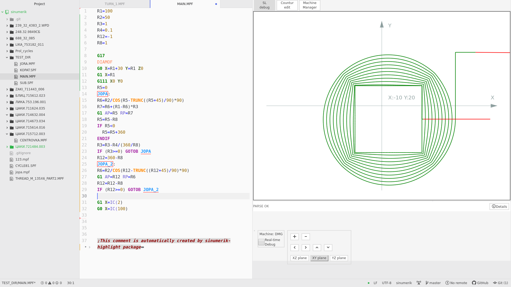

## sinumerik-highlight package

**Be sure to check the toolpath in a normal debugger, for example in the Sinutrain.**

**Package contain many errors. Infinite loop possible.**

**Please write issues as accurately as possible, with a minimum G-code for clarification.**

***
**Important! Before update package save ~.atom/packages/sinumerik-highlight/userData/ contents.**

***
Press Ctrl + Alt + o to activate higlight and show right panel.
Backlight colors are set tightly and were not checked in a dark theme.

You can select Lathe or mill type in Machine manager. The selected type affects the DIAMON settings (for lather) and the main plane (G17 for mill and G18 for lathe).
Subroutine folder path can be installed for every machine

Paths to corresponding snippets can be defined for each machine. See the snippet syntax on the wiki page. Navigation through the snippets menu items is carried out using the arrows keys

Single line debug allows you to see an approximate tool path.
Parsing errors can be seen by clicking on the button "Details".
Clicking on the graphic window allows you to control the view using the arrows as well as + (=) and - buttons

Linear interpolation supported including Ang modifier.
Circular interpolation programming is possible through:
- the end point and center
- the end point and radius CR (including arc > 180 degrees - CR < 0)
- the end point and AR
- the center point and AR

#### Supported futures:
- Polar coordinates (AP, RP)
- Rounding (RND) between two lines or line and arc
- Chamfer (only CHR) between lines
- DIAMON / DIAMOF / DIAM90
- [A]TRANS & [A]ROT $ [A]MIRROR
- Subroutines can be called from the same directory as the program and subroutine path of active machine with the parameters.
- R-variables
- G40/41/42 different colors
- OFFN
- $AA_IW[axis]
- $P_TOOLR equal 0
- Tool orientation $TC_DP2 can be used for tools T101-T109, where the units place corresponds to orientation (there are help image in machine manager)
- Tool orientation (T10[1-9]) can be parsed from comment in previous line ex. ';T103'
- Math SIN COS TAN ASIN ACOS ATAN2 POT SQRT TRUNC ROUND
- User variables definition and call assignment.
- GOTO[BF] jumps
- IF - ELSE - ENDIF
- REPEAT
- WHILE - ENDWHILE
- FOR TO  - ENDFOR
- string concatenation  
- MSG(" ") 
- EXECSTRING(" ")
- MCALL (max 1000 calls)

SINUMERIK standart cycles (eg HOLES2, CYCLE81) not supported.**

#### Keyboard shortcuts:
- "Ctrl + Alt + o" - open/close right panel
- "Ctrl + Alt + ;" - comment/uncomment selected lines; 
- "Ctrl + Alt + R" - draw tool path without changing scale
- " Alt + Spacebar" - open snippets menu

