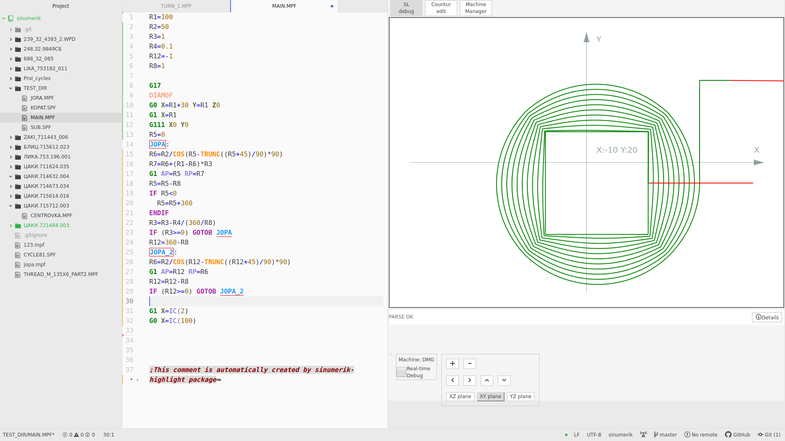

## sinumerik-highlight package

**Always verify the toolpath in a proper simulator, e.g. Sinutrain.**

**Please report issues as accurately as possible, with a minimal G-code example for reproduction.**

***

Press `Ctrl + Alt + O` to activate syntax highlighting and show the right panel.
UI and syntax highlight colors follow the active Pulsar theme — both light and dark themes are supported.

### Machine Manager

Select Lathe or Mill type in the Machine Manager. The selected type affects the DIAMON setting (for lathes) and the default plane (G17 for mill, G18 for lathe).

A subroutine folder path can be configured for each machine. The CNC type selector (Sinumerik / FANUC variants) is used by the companion **sinumerik-to-nc** package for G-code translation and has no effect on highlighting or debugging in this package.

Machine settings can be saved to a file as an inline comment in the program. On the next open, settings are restored automatically from that comment.

Paths to snippet files can be defined for each machine.
See snippet syntax at https://github.com/staniska/cnc-subroutines/tree/master/snippets/DMG_CTX510.
`Alt + Spacebar` — open snippets menu. Navigate through items with the arrow keys.

### Single Line Debugger

Displays an approximate toolpath for the active program. Press `Ctrl + Alt + R` to redraw without resetting the viewport.

- **Selecting lines** in the editor highlights the corresponding toolpath segment (thicker lines). If a subroutine call line is selected, the entire subroutine is highlighted.
- **Details** button shows parsing errors. Works from both 2D and 3D views.
- Click the canvas to focus it, then use arrow keys and `+` / `-` to navigate. Scroll and drag also work.
- **Machining time** is calculated and displayed after parsing.
- **Click a trajectory element** to jump to its source line in the editor. **Double-click** a subroutine element to open a popup with syntax-highlighted code, the call stack, and an "Edit" button.
- **Pin mode** — lock the SLD to a specific file while navigating subroutines. A suggestion to unpin appears when switching to an unrelated file.

Blank and part contours can be programmed as G-code files and drawn on the canvas.
Default names: `BLANK.MPF` and `CONTOUR.MPF`.

Shapes (blank, contour) are always read from the saved file on disk, while the main program trajectory follows the live editor buffer. Editing a shape file and comparing the saved shape against the live trajectory makes the effect of every change immediately visible — save the file when the new shape is the one you want.

#### WebGL renderer

A WebGL-based 2D renderer is available alongside the default Canvas 2D renderer. Toggle with the **Canvas / WebGL** segmented control in the footer; the choice is remembered between sessions. The WebGL renderer adds hover highlighting (thicker line) and editor selection glow on the trajectory.

#### Slow debug

Enable the **Slow debug** checkbox to animate the toolpath step by step. The progress bar supports scrubbing: click to jump to a position, then use arrow keys to step frame by frame. The active source line is highlighted with a yellow background — your cursor is not moved. If the frame comes from a subroutine, both the main editor and the open subroutine editor scroll to and highlight the active line. Slow debug works in all three renderers (Canvas 2D, WebGL 2D, 3D).

#### 3D viewport

Displays the toolpath in perspective mode. Camera position is preserved when switching between 2D and 3D views. Switching to a new file automatically returns to 2D view.
Mouse controls:
- LMB — rotate view
- Wheel — zoom
- Shift + LMB — pan view
- Ctrl — decrease rotate / pan / zoom speed

### ContourEdit

Helps create roughing cycles. Still in testing. The contour must be closed.
Calculated intersection points are shown in red. Starting elements are highlighted in green, ending elements in blue. The resulting code is inserted into the program when the cursor position changes.

### Interpolation

Linear interpolation is supported including the ANG modifier.
Circular interpolation:
- end point + center
- end point + radius CR (including arcs > 180° with CR < 0)
- end point + AR
- center point + AR

### Supported features

- Polar coordinates (AP, RP)
- Rounding (RND) between two lines or a line and an arc
- Chamfer (CHR) between lines
- DIAMON / DIAMOF / DIAM90
- [A]TRANS, [A]ROT & [A]MIRROR
- Subroutines called from the same directory as the program or from the machine subroutine path, with parameters
- R-variables
- User variable definitions and assignments
- User variables from a `.DEF` file placed in the subroutine folder (REAL, INT and STRING types; CHAN is ignored)
- G40 / G41 / G42 rendered in different colors
- OFFN
- `$AA_IW[axis]`
- Tool orientation via `$TC_DP2`: tools T101–T109, units digit = orientation (see help image in Machine Manager)
  > T103
- Tool orientation can also be parsed from a comment on the previous line:
  > ;T103
- Tool radius via `$P_TOOLR` set as a comment before tool change:
  > ;T103 R0.8
  > T="FINE_TOOL" D1 M6
- Lathe tool radius compensation (G41/G42): approach/departure paths are shortened. Programmed path is rendered, not the tool center path. Use with caution.
- Math: SIN, COS, TAN, ASIN, ACOS, ATAN2, POT, SQRT, TRUNC, ROUND
- GOTO[BF] jumps
- IF – ELSE – ENDIF
- REPEAT
- WHILE – ENDWHILE
- FOR TO – ENDFOR
- MSG(" ")
- EXECSTRING(" ")
- String concatenation (<<): works for strings without spaces; EXECSTRING has no such restriction
- MCALL (max 1000 calls)

Standard SINUMERIK cycles (e.g. HOLES2, CYCLE81) are not supported.

### Keyboard shortcuts

| Shortcut | Action |
|---|---|
| `Ctrl + Alt + O` | Open / close right panel |
| `Ctrl + Alt + ;` | Comment / uncomment selected lines |
| `Ctrl + Alt + R` | Redraw toolpath without resetting viewport |
| `Alt + Spacebar` | Open snippets menu |

