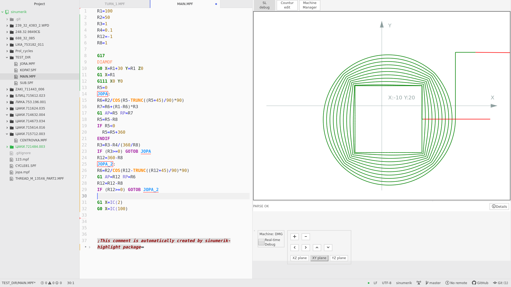

## sinumerik-highlight package

**Always verify the toolpath in a proper simulator, e.g. Sinutrain.**

**Please report issues as accurately as possible, with a minimal G-code example for reproduction.**

***

Press `Ctrl + Alt + O` to activate syntax highlighting and show the right panel.
UI and syntax highlight colors follow the active Pulsar theme — both light and dark themes are supported.

### Machine Manager

Select Lathe or Mill type in the Machine Manager. The selected type affects the DIAMON setting (for lathes) and the default plane (G17 for mill, G18 for lathe).

Existing machines can be edited — including renaming — via the Edit button in the machine's panel; subroutine/snippet folder links and the default-machine flag move with a rename.

Each machine also has a metric/inch unit setting, used as the default when a program has no explicit `G70`/`G71`. Machines created before this setting existed default to metric.

A subroutine folder path can be configured for each machine. The CNC type selector (Sinumerik / FANUC variants) is used by the companion **sinumerik-to-nc** package for G-code translation and has no effect on highlighting or debugging in this package.

Machine settings can be saved to a file as an inline comment in the program. On the next open, settings are restored automatically from that comment.

Paths to snippet files can be defined for each machine.
See snippet syntax at https://github.com/staniska/cnc-subroutines/tree/master/snippets/DMG_CTX510.
`Alt + Spacebar` — open snippets menu. Navigate through items with the arrow keys.

### Single Line Debugger

Displays an approximate toolpath for the active program. Press `Ctrl + Alt + R` to redraw without resetting the viewport.

- **Selecting lines** in the editor highlights the corresponding toolpath segment (thicker lines). If a subroutine call line is selected, the entire subroutine is highlighted.
- **Details** button shows parsing errors. Works in Canvas 2D, WebGL, and 3D views.
- Click the canvas to focus it, then use arrow keys and `+` / `-` to navigate. Scroll and drag also work.
- **Machining time** is calculated and displayed after parsing.
- **Click a trajectory element** to jump to its source line in the editor. **Double-click** a subroutine element to open a popup with syntax-highlighted code and a clickable call-stack: each nesting level is a chip — click it to inspect and navigate any intermediate call site. An "Edit" button opens the file at the active level.
- **Pin mode** — lock the SLD to a specific file while navigating subroutines. A suggestion to unpin appears when switching to an unrelated file.

Blank and part contours can be programmed as G-code files and drawn on the canvas.
Default names: `BLANK.MPF` and `CONTOUR.MPF`.

Shapes (blank, contour) are always read from the saved file on disk, while the main program trajectory follows the live editor buffer. Editing a shape file and comparing the saved shape against the live trajectory makes the effect of every change immediately visible — save the file when the new shape is the one you want.

A metric/inch toggle in the footer controls how the ruler numbers are displayed. It's display-only — it never changes what the program actually does; the toolpath itself always follows the machine's configured units or an explicit `G70`/`G71` in the code.

#### WebGL renderer

A WebGL-based 2D renderer is available alongside the default Canvas 2D renderer. Toggle with the **Canvas / WebGL** segmented control in the footer; the choice is remembered between sessions. The WebGL renderer adds hover highlighting (thicker line) and editor selection glow on the trajectory.

#### Slow debug

Enable the **Slow debug** checkbox to animate the toolpath step by step. The progress bar supports scrubbing: click to jump to a position, then use arrow keys to step frame by frame. The active source line is highlighted with a yellow background — your cursor is not moved. If the frame comes from a subroutine, both the main editor and the open subroutine editor scroll to and highlight the active line. Slow debug works in all three renderers (Canvas 2D, WebGL 2D, 3D).

#### 3D viewport

Displays the toolpath in perspective mode. Camera position is preserved when switching between 2D and 3D views. Switching to a new file automatically returns to 2D view.
Mouse controls:
- LMB — rotate view
- Wheel — zoom
- Shift + LMB — pan view
- Ctrl — decrease rotate / pan / zoom speed

Pan and zoom speed scale automatically with camera distance, so large scenes and fine details are equally navigable.

### ContourEdit

Helps create roughing cycles. Still in testing. The contour must be closed.
Calculated intersection points are shown in red. Starting elements are highlighted in green, ending elements in blue. The resulting code is inserted into the program when the cursor position changes.

When two lines overlap (fully or partially) in the same area, hover picks one or the other based on which side of the line the cursor sits on, so a microscopic mouse movement is enough to switch between coincident lines.

The plane (G17/G18/G19) and units (metric/inch) selectors sit at the top of the panel. Switching units changes the precision snap grid (`1 / 0.5 / 0.1 / 0.01` mm vs. `0.1 / 0.05 / 0.01 / 0.001"`), the coordinate/radius fields in the element properties panel, the cursor-position readout, and the numbers written into generated turning cycles. All of this is display and code-generation only — the underlying contour geometry is always stored in millimeters, so switching units never moves or rescales the contour itself.

### Bounding contour from a parametric subroutine

A subroutine such as `YAMA(X_START, X_END, Z_LEFT, Z_RIGHT, MAX_DEPTH, _ANG, _RND)` can carry a parametric outer-contour description between special comment markers:

```
;BOUNDING_CONTOUR_BEGIN
; IF (_ANG<20)
;   _ANG=30
; ENDIF
; G0 X=X_START Z=Z_LEFT
; G1 X=X_END ANG=-_ANG RND=_RND+12.5
; Z=Z_RIGHT-(X_START-X_END)/2/TAN(_ANG) RND=_RND+12.5
; X=X_START ANG=_ANG
; Z=Z_LEFT
;BOUNDING_CONTOUR_END
```

Every line of the block is prefixed with `;` so the block is inert at the machine and in normal parsing. Right-click the call line in the main program → **Create bounding contour** to materialize the shape: PROC parameters and `$AA_IW[X/Y/Z]` are resolved at the moment of the call, the generated shape lands in the contourEdit folder list as `SUBNAME · row N` and can be used as one of the sources for building a remnant-blank contour. Clicking the entry highlights the call row in the editor; moving the cursor clears the highlight.

Default values from the body's `IF/ENDIF` chain must be duplicated at the top of the bounding block — local `DEF` variables aren't visible because the body hasn't run yet. Calls inside `WHILE` / `FOR` / `REPEAT` are refused to keep the result unambiguous.

### Sectioned shape files (fixtures and tools)

Fixtures (chuck, steady rest) and tool outlines are plain G-code files split into coloured sections:

```
;NAME:TURN35 COLOR:#3b7dd8
;---VARIABLES
; T103 R0.4
; $TC_DP10=80
;---SECTION COLOR:#d8a13b ROLE:cut
G0 X0 Z0
G1 X-10 Z0
;---SECTION COLOR:#888888 ROLE:body
G0 X-10 Z-5
G1 X-30 Z-5
```

- `;NAME:` names the file and colours section 0. `COLOR:` is optional everywhere (default `#3b7dd8`).
- `;---SECTION` starts a section. `ROLE:` is `cut` (the cutting edge, which legitimately removes material), `body` (holder — anything it touches is a collision) or `ignore`. **A section without `ROLE:` counts as `body`**: a missing role then shows a false collision, which is visible and fixable, rather than a false all-clear.
- `;---VARIABLES` is optional and holds tool data as commented `KEY=VALUE` lines, so the block stays inert at the machine. `T10X R..` is shorthand for `$TC_DP2` and `$TC_DP6`. Keys are not validated against a list, values are converted to numbers only where they are used, and an index is optional (`$TC_DP6` and `$TC_DP6[1]` are the same field). No field is required — the outline alone is enough to draw a file.
- The leading `G0` of each section is the approach to its first point and is not drawn, as for `BLANK`/`CONTOUR`.
- Each section is parsed in isolation and inherits the program's plane, so a lathe outline (`G18`) lines up with the trajectory it rides on. It does **not** inherit `TRANS`/`MIRROR`/`ROT` or an active `G41`/`G42`: the file is drawn in its own coordinates.

**Tool files are measured and written in radii (`DIAMOF`)**, not in diameters — a tool has no diametral feature, its zero is the tool reference point and its dimensions are local, so a 0.4 mm nose radius is written as `R0.4` and a 10 mm flank as `X-10`. Fixtures are different: they are drawn in machine coordinates and follow the program's diameter mode, so their `X` is a diameter on a lathe.

Zero in a tool file is the **reference point of the compensation system** — the imaginary sharp tip for cutting-edge positions 1…8, the nose centre for a round insert (position 9). That is the point which rides along the trajectory, and it must be the same point any hand-computed radius compensation in the program was measured from.

### Interpolation

Linear interpolation is supported including the ANG modifier.
Circular interpolation:
- end point + center
- end point + radius CR (including arcs > 180° with CR < 0)
- end point + AR
- center point + AR

### Supported features

- Polar coordinates (AP, RP)
- Rounding between two lines or a line and an arc: one-shot (RND) or modal (RNDM, applies to every following corner until RNDM=0)
- Chamfer between lines: per-edge trim distance (CHR) or diagonal length (CHF)
- DIAMON / DIAMOF / DIAM90
- G70 / G700 (inch) and G71 / G710 (metric) — mid-program unit switching; the machine's own unit setting is the default when neither appears
- [A]TRANS, [A]ROT & [A]MIRROR
- Subroutines called from the same directory as the program or from the machine subroutine path, with parameters
- R-variables
- User variable definitions and assignments
- User variables from a `.DEF` file placed in the subroutine folder (REAL, INT and STRING types; CHAN is ignored)
- G40 / G41 / G42 rendered in different colors
- OFFN
- `$AA_IW[axis]`
- Tool orientation via `$TC_DP2`: tools T101–T109, units digit = orientation (see help image in Machine Manager)
  > T103
- Tool orientation can also be parsed from a comment on the previous line:
  > ;T103
- Tool radius via `$P_TOOLR` set as a comment before tool change:
  > ;T103 R0.8
  > T="FINE_TOOL" D1 M6
- Lathe tool radius compensation (G41/G42): approach/departure paths are shortened. Programmed path is rendered, not the tool center path. Use with caution.
- Math: SIN, COS, TAN, ASIN, ACOS, ATAN2, POT, SQRT, TRUNC, ROUND
- GOTO[BF] jumps
- IF – ELSE – ENDIF
- REPEAT
- WHILE – ENDWHILE
- FOR TO – ENDFOR
- MSG(" ")
- EXECSTRING(" ")
- String concatenation (<<): works for strings without spaces; EXECSTRING has no such restriction
- MCALL (max 1000 calls)

Standard SINUMERIK cycles (e.g. HOLES2, CYCLE81) are not supported.

### Keyboard shortcuts

| Shortcut | Action |
|---|---|
| `Ctrl + Alt + O` | Open / close right panel |
| `Ctrl + Alt + ;` | Comment / uncomment selected lines |
| `Ctrl + Alt + R` | Redraw toolpath without resetting viewport |
| `Alt + Spacebar` | Open snippets menu |


